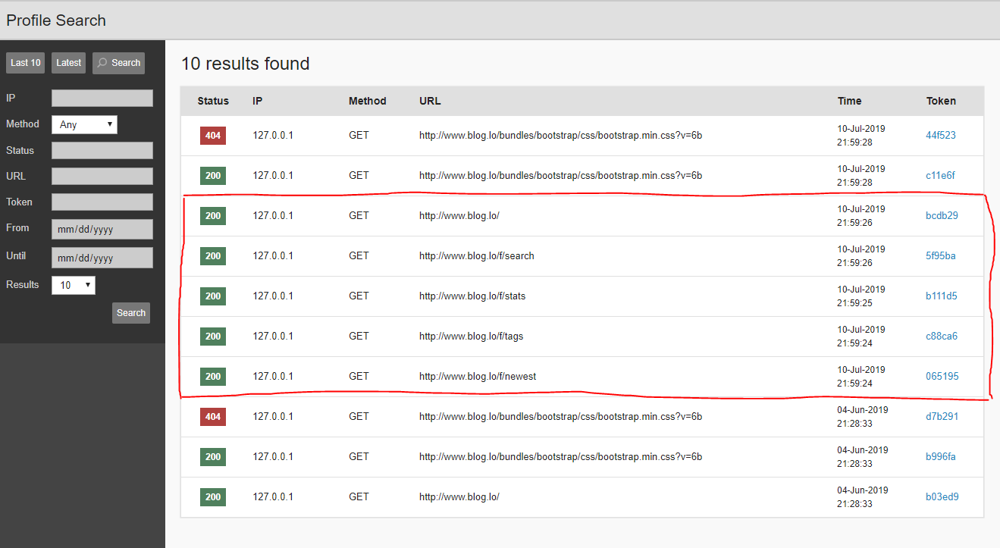
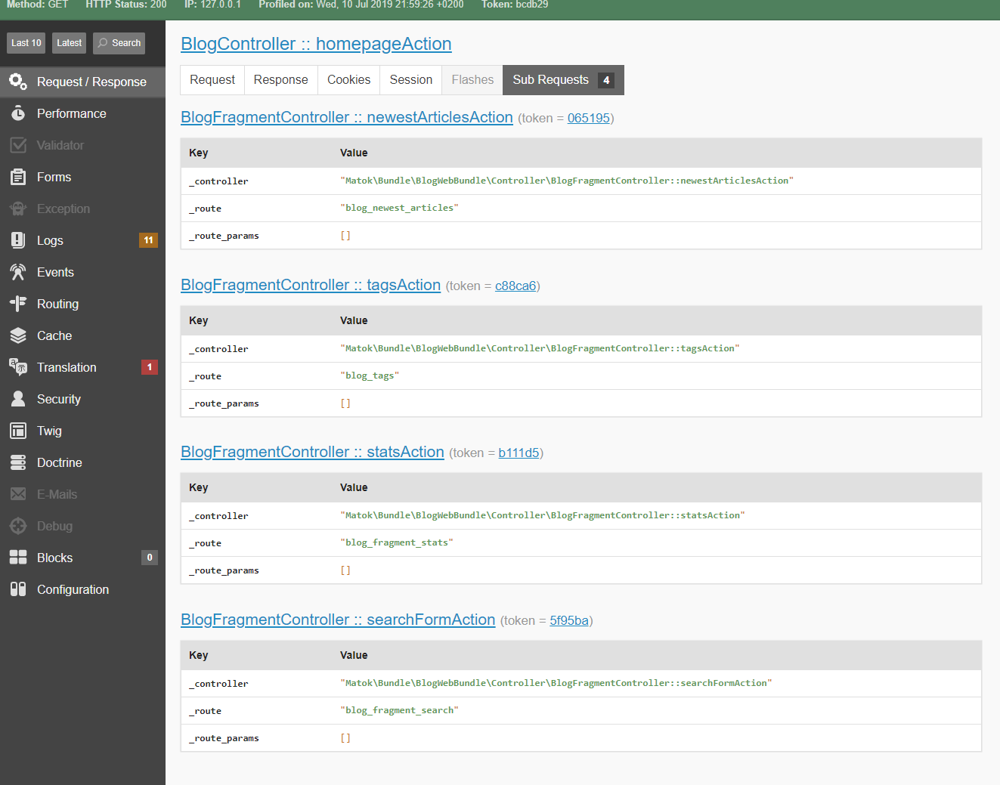

# Twig style Widgets

* twig has [filters](https://twig.symfony.com/doc/2.x/filters/index.html) (eg: [upper](https://twig.symfony.com/doc/2.x/filters/upper.html)) and [functions](https://twig.symfony.com/doc/2.x/functions/index.html) (eg: [date](https://twig.symfony.com/doc/2.x/functions/date.html))
* twig has [macros](https://twig.symfony.com/doc/2.x/tags/macro.html)
* twig has [include](https://twig.symfony.com/doc/2.x/tags/include.html)
* MEGA! https://symfony.com/doc/current/reference/twig_reference.html
* render / render esi https://symfony.com/doc/current/reference/twig_reference.html#render | Edge Side Includes [wiki](https://en.wikipedia.org/wiki/Edge_Side_Includes)


## Twing & Symfony filter definition

```php
// src/Twig/AppExtension.php
namespace App\Twig;

use Twig\Extension\AbstractExtension;
use Twig\TwigFilter;

class AppExtension extends AbstractExtension
{
    public function getFilters()
    {
        return [
            new TwigFilter('price', [$this, 'formatPrice']),
        ];
    }

    public function formatPrice($number, $decimals = 0, $decPoint = '.', $thousandsSep = ',')
    {
        $price = number_format($number, $decimals, $decPoint, $thousandsSep);
        $price = '$'.$price;

        return $price;
    }
}
```

Usage:
```
{{ '5500'|price }}
```


# A) Widget: include

**EmailController.php**
```php
return $this->render('email/list.html.twig', ['emails' => $emailRepo->getEmails($user->userId)]);
```

**email/list.html.twig**
```php
// TODO: inlude JS, CSS assets

<h1>List of emails</h1>

```

**email/table.html.twig**

```php
<table>
<thead>
    <tr>
        <td>Email</td>
        ...
        ...
    </tr>
</thead>
<tbody>
    
        <tr>
            <td>{{ email.address }}</td>
            ...
        </tr>
    
</tbody>
</table>
```


# B) Widget: Subrequests
**EmailController.php**
```php
return $this->render('email/list.html.twig', ['user_id' => $user->userId]);
```

**email/list.html.twig**
```php
// TODO: inlude JS, CSS assets

<h1>List of emails</h1>
{{ render(controller('App\\Widget\\EmailList::showEntries', {userId: user_id})) }}
```

**EmailList.php**
```php
        public function showEntriesAction(Request $request, $userId)
        {
            return $this->render('widget/email_table.html.twig', ['emails' => $emailRepo->getEmails($userId)]);
        }
```






# B) Widget: Subrequests & ESI
